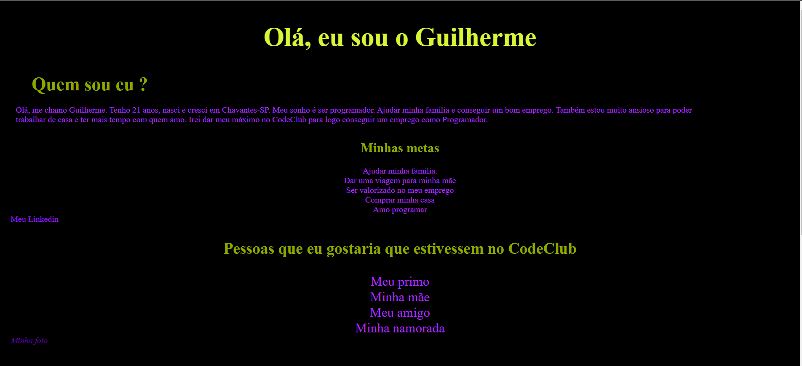

# HTML 1

> Image representing my presentation to the CODE CLUB course.

### Adjustments and improvements

The project is still under development and future updates will focus on the following tasks:

- [x] HTML creation
- [x] CSS creation
- [x] Finalization of the presentation project

## 🤝 Collaborator

We thank the following person who contributed to this project:

<table>
  <tr>
    <td align="center">
      <a href="#">
         
        
          <b>Guilherme Raposo</b>
        
      </a>
    </td>
  </tr>
</table>